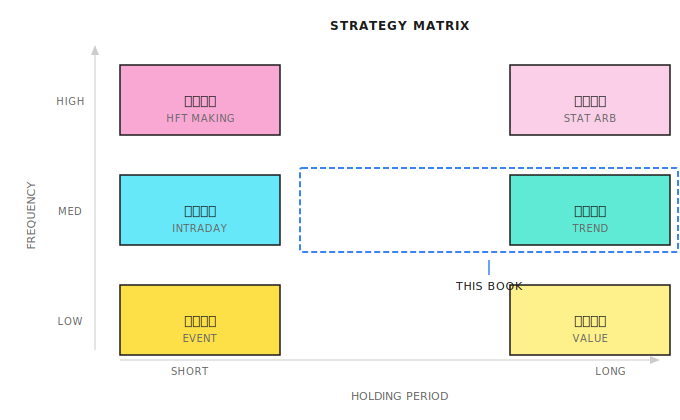
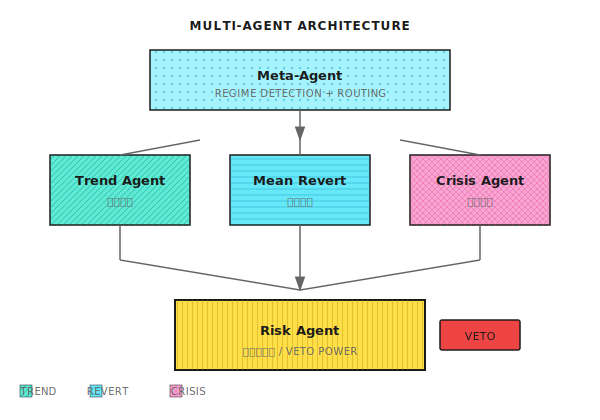
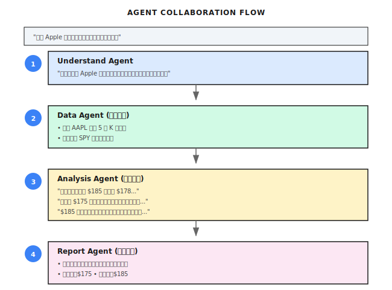
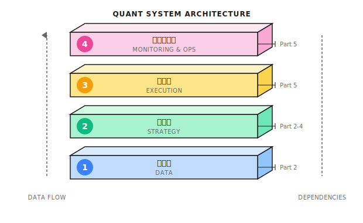
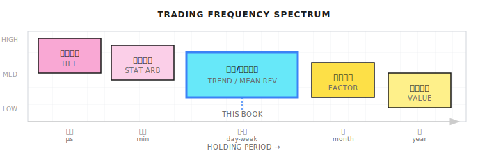
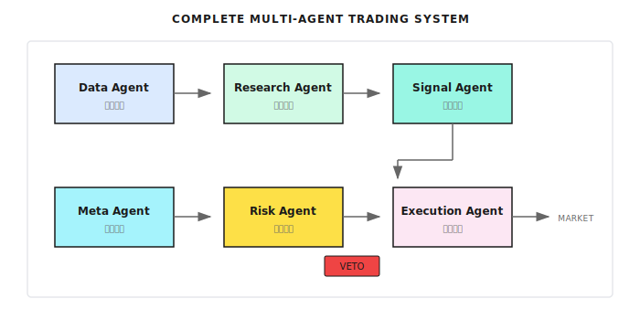
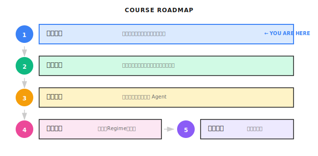

# 第 01 课：量化交易全景图

> **目标**：先建立全局视野，再深入细节。知道量化世界有哪些玩家、哪些策略、为什么需要多智能体架构，以及本书聚焦在哪里。

---

## 一个典型场景（示意）

> 注：以下为合成示例，用于说明常见现象；数字为示意，不对应任何具体个人/账户。

2020年，一位量化交易者开发了一个基于机器学习的美股策略，主要交易 S&P 500 成分股。回测收益惊人：年化 80%，夏普比率 2.5。

他信心满满地投入了 50 万美元。

前两个月，策略表现完美——顺着市场上涨趋势做多，账户增长 30%。然后市场进入震荡期，策略开始反复被打脸：追涨杀跌，每次都买在高点、卖在低点。三个月后，账户回撤 40%。

他尝试调整参数，让策略更适应震荡市。结果下一波趋势来临时，策略完美错过。

**问题出在哪里？** 不是模型不够好，而是**一个模型无法同时擅长所有市场状态**。趋势市需要动量策略，震荡市需要均值回归，危机市需要风控优先。这是结构性矛盾，不是调参能解决的。

但在讨论解决方案之前，我们先建立量化交易的全景认知。

---

## 1.1 量化交易的三个层次

很多人听到"量化交易"，脑海里浮现的画面各不相同：

- **散户**想的是：Python 写个策略，自动买卖股票，躺着赚钱
- **程序员**想的是：高频交易、纳秒级延迟、FPGA、机房托管
- **金融从业者**想的是：因子模型、风险平价、Smart Beta

他们说的都是"量化"，但完全不是一回事。

### 按资金规模和竞争维度划分

| 层次 | 典型资金 | 核心竞争力 | 代表玩家 |
|-----|---------|-----------|---------|
| **第一层：高频做市** | $1B+ | 速度（微秒级）、硬件、交易所关系 | Citadel Securities, Virtu, Jump |
| **第二层：机构量化** | $100M-$10B | 研究深度、因子挖掘、风控体系 | Two Sigma, DE Shaw, 幻方、九坤 |
| **第三层：中小型/个人** | <$100M | 灵活性、细分市场、执行纪律 | 小型对冲基金、自营交易者 |

### 第一层：高频做市（你打不过的对手）

**他们做什么**：在买卖价差中赚取利润，利用微秒级信息优势套利，每天交易数百万笔，每笔赚几分钱。

**为什么你打不过**：
```
你的订单延迟：50-100 毫秒（普通网络）
他们的延迟：5-50 微秒（交易所托管）
差距：1000-10000 倍
```

当你看到一个"好价格"准备下单时，他们已经完成了 1000 次交易。

> **结论**：除非你有数亿资金和顶级技术团队，否则不要碰高频。这是军备竞赛，散户必输。

### 第二层：机构量化（本书的学习目标）

**他们做什么**：中低频策略（持仓小时到数周），多因子模型、统计套利、事件驱动，严格的风控和组合管理。

**为什么值得学**：
- 不依赖速度优势，靠策略和风控取胜
- 方法论可复制，适合系统性学习
- 多智能体架构的主要应用场景

### 第三层：中小型/个人

**优势**：灵活性高、可做大机构看不上的小容量策略、试错成本低

**劣势**：数据和研究资源有限、容易情绪化交易、缺乏系统性风控

**本书的定位**：帮你用机构级的方法论，在个人/小团队规模下构建系统。

---

## 1.2 主要策略类型

### 策略分类地图



### 六大策略类型

| 策略类型 | 核心逻辑 | 持仓周期 | 难度 |
|---------|---------|---------|------|
| **高频做市** | 赚买卖价差，提供流动性 | 秒-分钟 | ★★★★★ |
| **统计套利** | 相关资产价差回归 | 分钟-天 | ★★★★ |
| **趋势跟随** | 价格动量持续性 | 天-周 | ★★★ |
| **均值回归** | 价格偏离后回归 | 小时-天 | ★★★ |
| **事件驱动** | 财报、并购等事件 | 天-月 | ★★★★ |
| **多因子** | 组合多个 Alpha 因子 | 周-月 | ★★★★ |

### 策略的生命周期

**重要认知**：没有永远有效的策略。

```
发现 → 验证 → 部署 → 衰减 → 退役
```

你的系统必须能**持续进化**——这就是为什么我们需要多智能体架构。

---

## 1.3 为什么需要多智能体架构

回到开篇的故事：单一模型为什么失败？

### 单一模型的致命缺陷

市场在不同状态间切换：

| 市场状态 | 最佳策略 | 单一模型的问题 |
|---------|---------|---------------|
| **趋势市** | 动量策略：顺势加仓 | 震荡市会被反复打脸 |
| **震荡市** | 均值回归：高抛低吸 | 趋势市会错过大行情 |
| **危机市** | 风控优先：减仓避险 | 可能在暴跌中满仓硬扛 |

**核心问题：一个模型无法同时擅长所有状态。** 这是结构性缺陷，不是调参能解决的。

### 多智能体的解决思路



**三个核心设计原则：**

1. **专家分工**：不同 Agent 负责不同市场状态，各自做到极致
2. **动态路由**：Meta-Agent 判断当前是什么市场，把任务分发给对应专家
3. **风控独立**：Risk Agent 拥有一票否决权，任何专家的建议都要过风控

### 常见误区

| 误区 | 事实 |
|-----|------|
| "多智能体就是多跑几个模型" | 关键是**协作机制**：谁说了算？冲突怎么解决？ |
| "单一模型调参调到极致也行" | 市场状态是**结构性变化**，不是噪声，调参解决不了 |
| "Agent 会自动赚钱" | Agent 是工具，Alpha 来自你的策略设计和风控纪律 |
| "量化就是预测价格" | 量化是**管理风险下的收益**，预测只是手段之一 |

### 多智能体的适用边界

任何架构都有适用边界。多智能体在以下情况可能不如单一模型：

| 失效场景 | 原因 |
|---------|------|
| **市场状态切换太快** | Meta-Agent 识别滞后，切换时已错过最佳时机 |
| **状态边界模糊** | 趋势和震荡交替出现，每个专家都只对一半 |
| **协调成本 > 收益** | 简单市场用复杂架构，过度工程 |

**核心原则**：如果你的策略只在单一市场状态下运行，单一模型可能更简单有效。多智能体的价值在于**跨状态的稳健性**。

---

## 1.4 多智能体协作示例

用一个市场分析任务，展示多智能体如何协作：



### 关键协作模式

| 模式 | 说明 | 适用场景 |
|-----|------|---------|
| **Chain (链式)** | Agent A → B → C，顺序执行 | 有明确依赖关系的任务 |
| **DAG (并行)** | 多个 Agent 同时执行，结果汇总 | 独立子任务，如分析多只股票 |
| **Debate (辩论)** | 多个 Agent 对同一问题给出不同观点 | 需要多角度分析的决策 |
| **Reflection (反思)** | Agent 检查自己或他人的输出 | 提高输出质量 |

---

## 1.5 技术栈与本书定位

### 量化系统的四层架构



| 层次 | 核心问题 | 本书覆盖 |
|-----|---------|---------|
| **数据层** | 数据从哪来？如何保证质量？ | Part 2 第06课 |
| **策略层** | 信号怎么生成？风险怎么控制？ | Part 2-4 |
| **执行层** | 如何最小化交易成本？ | Part 5 第18-19课 |
| **运维层** | 系统挂了怎么办？ | Part 5 第20课 |

### 本书聚焦：中频多智能体系统



| 维度 | 本书定位 | 原因 |
|-----|---------|------|
| **频率** | 日内到周级 | 不需要硬件军备竞赛 |
| **策略** | 趋势 + 均值回归 + 风控 | 经典有效，适合演示 |
| **架构** | 多智能体协作 | 解决单一模型的结构性问题 |
| **目标** | 风险调整后收益 | 不追求暴利，追求稳健 |

---

## 1.6 完整系统架构预览

本课建立的认知，对应到完整多智能体交易系统：



| Agent | 职责 | 课程 |
|-------|------|------|
| **Data Agent** | 数据获取、清洗、对齐 | Part 2 第06课 |
| **Research Agent** | 市场分析、趋势识别 | Part 2 第04-05课 |
| **Signal Agent** | 生成交易信号 | Part 3 第10课 |
| **Meta Agent** | 市场状态识别、任务分发 | Part 4 第11-12课 |
| **Risk Agent** | 风控审核、一票否决 | Part 4 第15课 |
| **Execution Agent** | 订单拆分、执行优化 | Part 5 第19课 |

---

## 1.7 课程路线图



**贯穿全程的核心问题：**
1. 为什么单一模型不够？
2. 多智能体如何解决？
3. 如何构建能持续进化的系统？

---

## 本课交付物

完成本课后，你将获得：

1. **量化交易的分层认知** - 知道高频、机构、个人各自在做什么
2. **策略类型的全景地图** - 理解六大策略类型的逻辑和适用场景
3. **对多智能体架构的直觉理解** - 知道为什么需要多个专家而不是一个全能模型
4. **清晰的学习边界** - 知道本书聚焦什么，不覆盖什么

---

## 本课要点回顾

- [x] 量化交易分三个层次：高频做市（打不过）、机构量化（学习目标）、个人/小型（起点）
- [x] 六大策略类型：高频做市、统计套利、趋势跟随、均值回归、事件驱动、多因子
- [x] 单一模型的结构性缺陷：无法同时擅长趋势、震荡、危机三种市场
- [x] 多智能体的三个核心原则：专家分工、动态路由、风控独立
- [x] 本书定位：中频多智能体量化系统，不追求暴利，追求稳健可持续

---

## 延伸阅读

- [背景知识：Alpha 与 Beta](背景知识/Alpha%20与%20Beta.md) - 理解收益的来源
- [背景知识：主流量化基金排名](背景知识/主流量化基金排名.md) - 看看顶级机构的策略风格
- [背景知识：中美量化市场差异](背景知识/中美量化市场差异.md) - 不同市场的玩法差异
- [背景知识：历史著名量化事故](背景知识/历史著名量化事故.md) - 前车之鉴，风控为什么是一票否决

---

## 下一课预告

**第 02 课：金融市场与交易基础**

现在你知道了量化世界的全貌和多智能体架构的核心思想。接下来我们回归常识：市场是怎么运作的？订单是怎么成交的？什么是滑点和市场冲击？这些基础知识是构建任何量化系统的前提。
